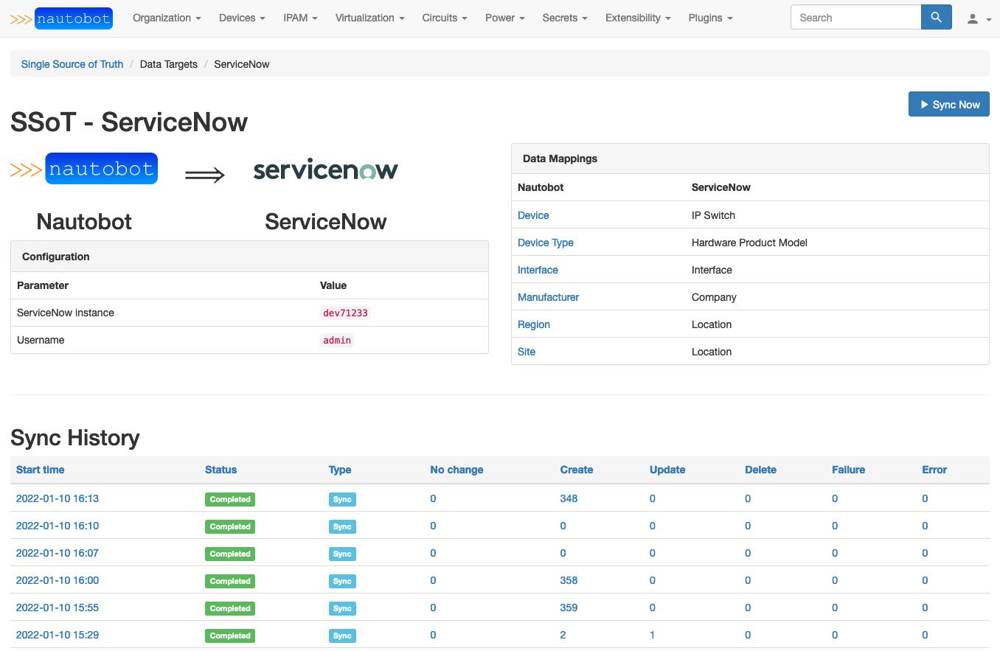

# Nautobot Single Source of Truth -- ServiceNow Data Target

A plugin for [Nautobot](https://github.com/nautobot/nautobot), building atop the [nautobot-ssot](https://github.com/nautobot/nautobot-plugin-ssot/) plugin.

This plugin provides the ability to synchronize data from Nautobot into ServiceNow. Currently the following data is mapped and synchronized:

- Nautobot Region and Site tables to ServiceNow Location table
- Nautobot Device table to ServiceNow IP Switch table
- Nautobot Interface table to ServiceNow Interface table

## Installation

The plugin is available as a Python package in PyPI and can be installed with `pip` into an existing Nautobot installation:

```shell
pip install nautobot-ssot nautobot-ssot-servicenow
```

> The plugin is compatible with Nautobot 1.0.3 and higher

Once installed, the plugin needs to be enabled in your `nautobot_config.py`:

```python
# nautobot_config.py
PLUGINS = [
    "nautobot_ssot",
    "nautobot_ssot_servicenow",
]

PLUGINS_CONFIG = {
    "nautobot_ssot": {
        "hide_example_jobs": True,
    },
    "nautobot_ssot_servicenow": {
        "instance": "dev12345",
        "username": os.getenv("SERVICENOW_USERNAME"),
        "password": os.getenv("SERVICENOW_PASSWORD"),
    },
}
```

The plugin behavior can be controlled with the following list of settings:

- `instance`: The ServiceNow instance to point to (as in `<instance>.servicenow.com`)
- `username`: Username to access this instance
- `password`: Password to access this instance

## Questions

For any questions or comments, please check the [FAQ](FAQ.md) first and feel free to swing by the [Network to Code slack channel](https://networktocode.slack.com/) (channel #networktocode).
Sign up [here](http://slack.networktocode.com/)

## Screenshots



---


